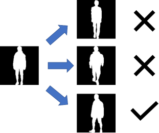

# Peasant-Identity Identification Challenge / 农民身份识别挑战赛
This repository is set for the Farmer Identification Challenge organized by China Agricultural University(CAU).
The competition link: <https://challenge.xfyun.cn/topic/info?type=peasant-identity>

本项目为参加由中国农业大学组织的农民身份识别挑战赛创建。赛题链接为：<https://challenge.xfyun.cn/topic/info?type=peasant-identity>

## Background Information / 赛题背景
Although machines are heavily used in agricultural production, people are still an indispensable factor. Through the identification of farmers, it can truly and objectively record the state of farmers, providing real and objective data for farm management and traceability of agricultural products; compared with direct storage of video, it can effectively reduce the storage space; automatic identification is also more than manual supervision, substantially improving efficiency and reducing labor costs.

机器虽然被大量用到农业生产中，但人还是不可或缺的因素。通过农民身份识别，可以真实客观地记录农民的状态，为农场管理和农产品追溯提供真实的客观数据；较之直接存储视频，可以有效地降低存储空间；自动识别也比人工监管，大幅度提高效率，减少人工成本。

## Mission / 赛事任务
Peasant-Identity identification requires the classification of farmers, and this competition provides image sequences made from laboratory videos from China Agricultural University. Contestants first preprocess the images and make samples to recognize the farmers in the images. Contestants need to train their own models and upload their trained models and weights.

农民身份识别需要对农民进行分类，本次大赛提供了中国农业大学实验室视频制成的图像序列。参赛选手先对图像进行预处理，并制作样本，对图像中的农民进行识别。选手需要自行训练模型，并上传自己训练好的模型和权重。

## Dataset / 赛题数据集
The competition provided the contestants with 25 farmer identities, each containing an image sequence made from 10 videos, and the contestants were required to preprocess the image sequences, tag them, and identify the farmers.

本次比赛为参赛选手提供了25名农民身份，每个身份包含10段视频制成的图像序列，选手需要对图像序列进行预处理，打标签，并对农民进行身份识别。

## Evaluation / 评价指标
The model was evaluated using Macro-F1 based on the submitted results document.

本模型依据提交的结果文件，采用Macro-F1进行评价。

## Ideas / 思路
The problem is a classic image classification problem.
1. Use ResNet model to do transfer learning
2. Not yet available

该问题为典型的图像多分类问题。
1. 采用现有模型(ResNet)进行迁移学习
2. 暂无